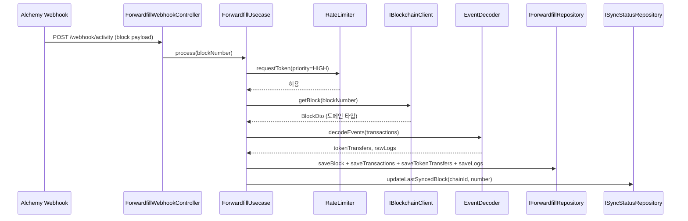
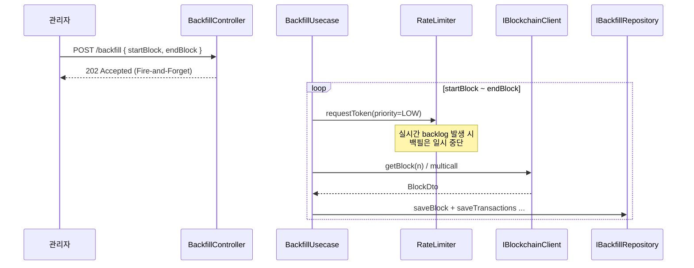
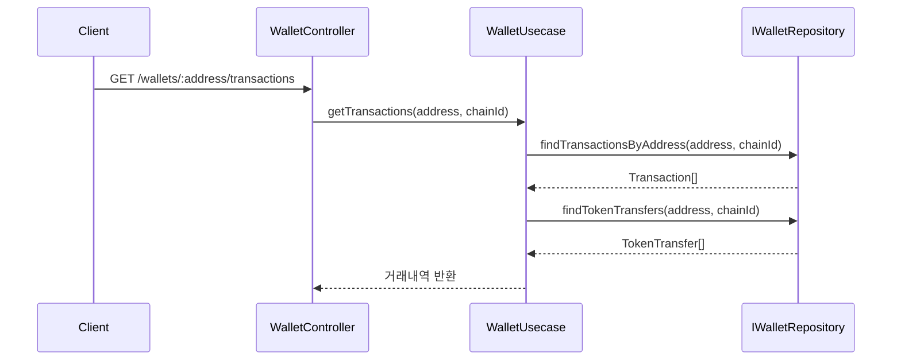
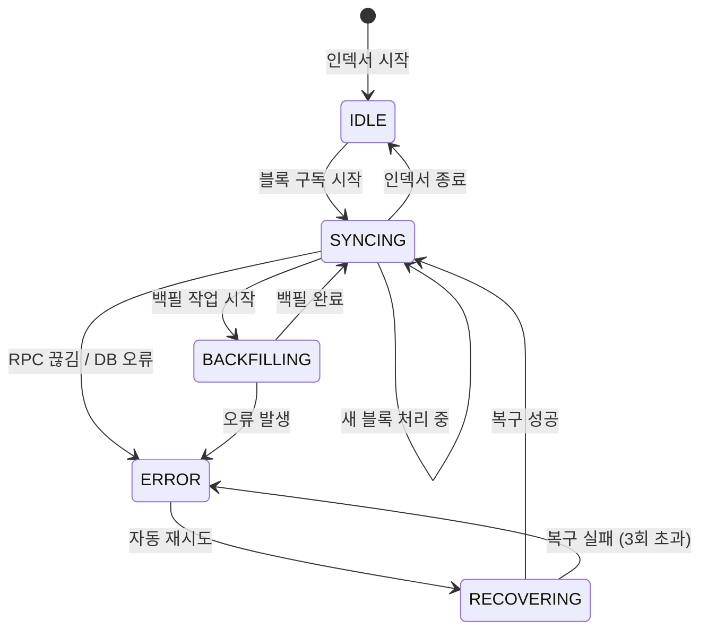
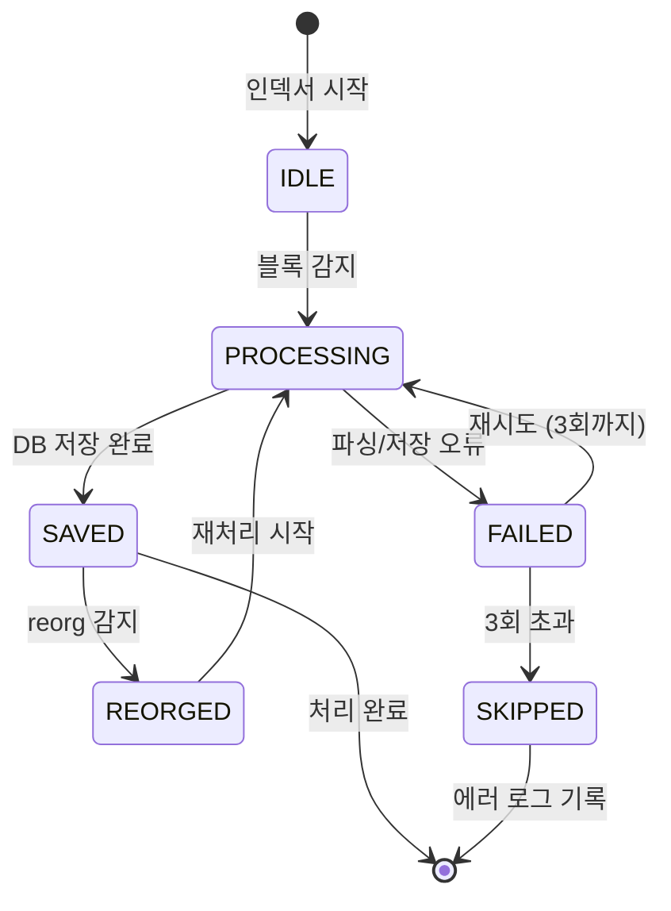

# 인덱서 설계 (피드백 이후)

> **정본**: 이 문서 (`docs/design.md`)
> **미러**: [노션 페이지](https://www.notion.so/365c782cda0380089666eeff993048b7) (회의/공유용)
> **이전 설계**: [4주차: 인덱서 이야기](https://www.notion.so/341c782cda038053840de77625bb6d97) (피드백 이전 원본 — 보존용)

---

## 0. 이 문서는?

2026-04-28 코드 리뷰 피드백을 반영해 **다시 설계한 인덱서 스펙**.

원본 설계서의 ERD / API / 요구사항 / 테스트 케이스 / 상태 다이어그램 / 기술 스택은 그대로 유효하며 이 문서에 통합됨. 변경된 부분(폴더 구조, 의존성, 인터페이스, 네이밍)은 §1~§6 에 정리.

---

## 1. 받은 피드백 요약 (2026-04-28)

| # | 분류 | 피드백 | 적용 |
|---|------|--------|------|
| 1 | 구조 | 기능별 모듈(backfill / forwardfill / wallet) 분리 — 독립 배포·롤백 | 폴더 구조 |
| 2 | 구조 | 각 모듈 안에서 `controller / usecase / domain / infrastructure` 4-layer 분리 | 폴더 구조 |
| 3 | 의존성 | 의존성 방향: `controller → usecase → domain ← infrastructure`. 도메인은 외부 의존 금지 | 모든 모듈 |
| 4 | 도메인 | 도메인 레이어 오염 금지 — Viem 응답 타입을 usecase 까지 끌고 들어오지 말 것 | forwardfill, backfill |
| 5 | 인터페이스 | `IRepository` god interface 분리 — 책임별로 쪼개기 | repository.interface.ts |
| 6 | 네이밍 | Human-readable — `IViemClient` → `IBlockchainClient` | 인터페이스 네이밍 |

---

## 2. 폴더 구조

### AS-IS (원본 — 폐기됨)

```
src/
├── domain/         # 도메인 + god IRepository
├── indexer/        # BlockListener / BlockProcessor / BackfillWorker / ... 한 덩어리
├── wallet/         # WalletService
├── chain/          # ChainService
├── backfill/       # BackfillService (워커는 indexer/ 에 있음 — 강결합)
├── status/         # StatusService
└── repository/     # PrismaRepository
```

**문제**: indexer/ 안에 실시간 + 백필이 같이 있어 분리 불가. BackfillService 가 indexer/BackfillWorker 를 import → 모듈 경계 흐림. IRepository 가 모든 책임 보유.

### TO-BE (적용)

```
src/
├── domain/                      # 공용 도메인 타입 (Block, Transaction, ...)
│
├── backfill/                    # 과거 블록 소급 처리
│   ├── controller/
│   ├── usecase/
│   ├── domain/                  # IBlockchainClient, IBackfillRepository
│   └── infrastructure/          # ViemBlockchainClient, BackfillPrismaRepository
│
├── forwardfill/                 # 실시간 블록 수집 (구 BlockListener)
│   ├── controller/
│   ├── usecase/
│   ├── domain/
│   └── infrastructure/
│
├── wallet/
│   ├── controller/
│   ├── usecase/
│   ├── domain/                  # IWalletRepository
│   └── infrastructure/
│
├── chain/
│   └── ...
│
├── status/
│   └── ...
│
└── app.module.ts                # DI 조립
```

### 의존성 규칙

```
controller → usecase → domain ← infrastructure
```

- `domain/` 은 Viem, Prisma, NestJS 어떤 외부 의존도 없음 (순수 타입 + 인터페이스)
- `infrastructure/` 는 `domain/` 인터페이스를 구현
- 모듈 간 직접 참조 금지 — 공용 `src/domain/` 통하거나 DI 주입

---

## 3. 클래스 구조

```
backfill 모듈
├── controller/  BackfillController        # POST /backfill
├── usecase/     BackfillUsecase           # 범위 처리 + RateLimiter + 저장
├── domain/      IBlockchainClient
│                IBackfillRepository
└── infrastructure/
                 ViemBlockchainClient implements IBlockchainClient
                 BackfillPrismaRepository implements IBackfillRepository

forwardfill 모듈
├── controller/  ForwardfillWebhookController  # POST /webhook/activity
├── usecase/     ForwardfillUsecase            # 단일 블록 처리 (우선순위 HIGH)
├── domain/      IBlockchainClient (재사용)
│                IForwardfillRepository
└── infrastructure/
                 ViemBlockchainClient (공용)
                 ForwardfillPrismaRepository

wallet 모듈
├── controller/  WalletController              # GET /wallets/:address/*
├── usecase/     WalletUsecase                 # 거래내역/잔액/통계
├── domain/      IWalletRepository
└── infrastructure/
                 WalletPrismaRepository
                 AlchemyAssetTransferClient    # 과거 이력 import

chain / status 모듈 — 동일 구조
```

### 공용 모듈

- `EventDecoder` — ABI 디코딩 (backfill, forwardfill 공유)
- `RateLimiter` — RPC 토큰 버킷 (실시간 우선순위 적용 지점)
- `SyncStatusManager` — `last_synced_block` 추적 → `status` 모듈로 흡수

---

## 4. 시퀀스 다이어그램

### 4.1 실시간 블록 처리 (Alchemy Webhook)



**핵심:**

- `BlockListener` 제거 → `ForwardfillWebhookController` 로 대체 (Alchemy Webhook)
- Viem 응답은 `IBlockchainClient` 가 `BlockDto`(도메인 타입)로 변환해서 usecase 에 전달 → 도메인 오염 해결
- 저장은 `IForwardfillRepository` 인터페이스로 분리

### 4.2 백필 처리



**핵심:**

- 컨트롤러는 `202 Accepted` 즉시 반환 (Fire-and-Forget)
- usecase 에서 `try/catch + Logger.error` 로 비동기 에러 추적
- 실시간 우선순위는 RateLimiter 에서 제어

### 4.3 지갑 조회



---

## 5. 인터페이스 분리

god `IRepository` → 책임별 분리:

```ts
// backfill/domain/
interface IBackfillRepository {
  saveBlock(block: Block): Promise<void>;
  saveTransactions(txs: Transaction[]): Promise<void>;
  saveTokenTransfers(transfers: TokenTransfer[]): Promise<void>;
  saveLogs(logs: RawLog[]): Promise<void>;
  findBlock(number: bigint, chainId: number): Promise<Block | null>;
  markReorged(number: bigint, chainId: number): Promise<void>;
}

// forwardfill/domain/  — backfill 과 같은 책임 (공용 IBlockRepository 로 통합 가능)
interface IForwardfillRepository extends IBackfillRepository {}

// wallet/domain/
interface IWalletRepository {
  findTransactionsByAddress(address: string, chainId: number): Promise<Transaction[]>;
  findTokenTransfers(address: string, chainId: number): Promise<TokenTransfer[]>;
  getTopContracts(address: string, chainId: number): Promise<{ contractAddress: string; count: number }[]>;
  getFirstTransaction(address: string, chainId: number): Promise<Transaction | null>;
}

// status/domain/
interface ISyncStatusRepository {
  getSyncStatus(chainId: number): Promise<SyncStatus | null>;
  findAllSyncStatus(): Promise<SyncStatus[]>;
  updateSyncStatus(chainId: number, lastSyncedBlock: bigint, status: IndexerStatus, errorMessage?: string): Promise<void>;
}

// chain/domain/
interface IChainRepository {
  findChain(chainId: number): Promise<Chain | null>;
  findAllChains(): Promise<Chain[]>;
  saveChain(chain: Chain): Promise<void>;
}
```

각 인터페이스의 구현체는 `<module>/infrastructure/` 의 `*PrismaRepository` 가 담당. Prisma 클라이언트는 공용 모듈 제공.

---

## 6. 네이밍 변경

| AS-IS | TO-BE | 이유 |
|-------|-------|------|
| `IViemClient` | `IBlockchainClient` | 인터페이스는 책임 기준 |
| `class ViemClient` | `class ViemBlockchainClient implements IBlockchainClient` | 구현체는 도구 + 책임 명시 |
| `BackfillWorker` | `BackfillUsecase` | 4-layer 명칭 통일 |
| `BlockProcessor` | (각 모듈의 `*Usecase` 안으로 흡수) | 모듈 경계 명확화 |
| `WalletService` | `WalletUsecase` | 동일 |

---

## 7. 도메인 설계 (원본 유지)

### 7.1 기능적 요구사항

| 구분 | 기능 | 상세 | API |
|------|------|------|-----|
| 핵심 | 블록 감지 및 저장 | 새 블록 즉시 감지/파싱. 저장: number, hash, parent_hash, timestamp, gas_used. 중복 수신 시 upsert | - |
| 핵심 | 트랜잭션 저장 | 블록 내 모든 트랜잭션 저장. 빈 블록도 blocks 엔 저장 | - |
| 핵심 | Transfer 이벤트 디코딩 | ERC-20 Transfer ABI 디코딩 → token_transfers. 실패 시 logs 폴백 | - |
| 핵심 | 멀티체인 지원 | chain_id 로 구분, 체인별 독립 sync_status | GET/POST /chains |
| 핵심 | 거래내역 조회 | from/to 기준 트랜잭션. 없는 주소는 빈 배열 | GET /wallets/:address/transactions |
| 핵심 | 토큰 잔액 | token_transfers 기준 집계 | GET /wallets/:address/balances |
| 부가 | 통계 | TOP 컨트랙트, 총 거래 수, 첫 거래일 | GET /wallets/:address/stats |
| 부가 | 백필 | start_block ~ end_block 소급. 이미 인덱싱된 블록 skip | POST /backfill |

### 7.2 비기능적 요구사항

| 구분 | 항목 | 상세 |
|------|------|------|
| 성능 | rate limit | 초당 N 건 제한. 초과 시 exponential backoff + retry. 구체화: §8.4 |
| 안정성 | reorg 처리 | finality_depth 이하 블록은 매 싱크마다 재확인 |
| 성능 | 실시간 vs 백필 우선순위 | 실시간이 토큰 우선 사용. 실시간 지연 시 백필 일시 중단 |
| 안정성 | 장애 복구 | sync_status.last_synced_block 기준 재개 |
| 확장성 | 멀티체인 확장 | chains row + 인스턴스 추가만으로 완료 |
| 안정성 | 에러 추적 | sync_status.error_message 기록. 동일 블록 3회 실패 시 skip |

### 7.3 데이터 모델 (ERD)

**처리 흐름**: 블록 감지 → blocks 저장 → transactions 저장 → 이벤트 디코딩 → token_transfers(성공) 또는 logs(실패) → sync_status 업데이트 → reorg 확인

#### chains — 지원 체인 목록

| 컬럼 | 설명 |
|------|------|
| **chain_id** (PK) | 체인 고유 번호 (Ethereum=1, Base=8453) |
| name | 체인 이름 |
| finality_depth | reorg 감지 재확인 블록 수 |

#### blocks — 블록 정보

| 컬럼 | 설명 |
|------|------|
| **number** (PK) | 블록 번호 |
| **chain_id** (PK) | 어느 체인 |
| hash | 블록 고유 식별자 |
| parent_hash | 이전 블록 연결 |
| timestamp | 생성 시각 |
| gas_used | 실제 사용 가스 |
| gas_limit | 최대 허용 가스 |
| base_fee_per_gas | 기본 가스 단가 |
| is_reorged | reorg 발생 시 true |

#### transactions — 트랜잭션 정보

| 컬럼 | 설명 |
|------|------|
| **hash** (PK) | 트랜잭션 식별자 |
| **chain_id** | 어느 체인 |
| **block_number** | 포함 블록 |
| block_hash | 블록 hash |
| from_address / to_address | 보낸/받는 주소 |
| value | 전송 금액 (wei) |
| gas | 가스 한도 |
| input | 컨트랙트 호출 데이터 (hex) |
| nonce | 주소별 트랜잭션 순서 |
| transaction_index | 블록 내 순서 |
| status | 성공/실패 |

#### token_transfers — ERC-20 전송 이벤트 (디코딩 성공)

| 컬럼 | 설명 |
|------|------|
| id (PK) | 자동 증가 |
| **chain_id** | 어느 체인 |
| **tx_hash** | 어느 트랜잭션 |
| block_number | 블록 번호 |
| contract_address | 토큰 컨트랙트 주소 |
| from_address / to_address | 보낸/받는 주소 |
| amount | 전송 수량 |
| log_index | 이벤트 순서 |

#### logs — raw 데이터 (디코딩 실패 폴백)

| 컬럼 | 설명 |
|------|------|
| id (PK) | 자동 증가 |
| **chain_id** | 어느 체인 |
| **tx_hash** | 어느 트랜잭션 |
| block_number | 블록 번호 |
| contract_address | 컨트랙트 주소 |
| topic0 | 이벤트 종류 해시 |
| data | 원본 데이터 (hex) |
| log_index | 이벤트 순서 |

#### sync_status — 인덱서 동기화 상태

| 컬럼 | 설명 |
|------|------|
| id (PK) | 자동 증가 |
| chain_id | 어느 체인 |
| last_synced_block | 마지막 처리 완료 블록 |
| status | SYNCING / ERROR / IDLE / BACKFILLING / RECOVERING |
| error_message | 오류 원인 |
| updated_at | 마지막 업데이트 시각 |

### 7.4 테스트 케이스

**정상**

| # | 기능 | 시나리오 | 기대 결과 |
|---|------|---------|----------|
| T-01 | 블록 감지 | 새 블록 들어옴 | blocks 저장 |
| T-02 | 중복 블록 | 같은 블록 두 번 | upsert (중복 X) |
| T-03 | 트랜잭션 저장 | 100건 | 100건 전부 저장 |
| T-04 | 빈 블록 | 트랜잭션 0건 | blocks 저장, transactions 0건 |
| T-05 | Transfer 디코딩 | ERC-20 이벤트 | token_transfers 저장 |
| T-06 | 지갑 조회 | 특정 주소 | from/to 전체 반환 |
| T-07 | 없는 주소 | 거래 없음 | 빈 배열 |
| T-08 | 멀티체인 | Ethereum + Base | 체인별 독립 저장 |

**실패**

| # | 기능 | 시나리오 | 기대 결과 |
|---|------|---------|----------|
| T-09 | RPC 끊김 | 구독 중 끊김 | 에러 로그 + 자동 재연결 |
| T-10 | rate limit | 한도 초과 | 큐 + backoff + retry |
| T-11 | 디코딩 실패 | Transfer 실패 | logs 에 raw 저장 |
| T-12 | DB INSERT 실패 | PostgreSQL 끊김 | sync_status error 기록, 재시도 |
| T-13 | 3회 실패 | 같은 블록 3번 실패 | skip + 에러 로그 |

**복구**

| # | 기능 | 시나리오 | 기대 결과 |
|---|------|---------|----------|
| T-14 | 정상 종료 재시작 | 정상 종료 후 재시작 | last_synced_block 부터 재개 |
| T-15 | 비정상 종료 재시작 | 갑자기 죽음 | 동일하게 재개, 중복 X |
| T-16 | reorg | 재편성 감지 | is_reorged = true, 재처리 |
| T-17 | 백필 중 실시간 | 백필 중 새 블록 | 실시간 먼저, 백필 대기 |

### 7.5 상태 다이어그램

**인덱서 자체 상태:**



**블록 처리 상태:**



### 7.6 API 명세

| # | 명 | Method | URL | 요청 | 응답 | 에러 |
|---|----|--------|-----|------|------|------|
| API001 | 지원 체인 목록 | GET | /chains | - | chain_id, name, finality_depth | - |
| API002 | 체인 추가 | POST | /chains | chain_id, name, finality_depth | 추가된 chain_id, name | 중복 시 409 |
| API003 | 거래내역 조회 | GET | /wallets/:address/transactions | address, chain_id, from_date?, to_date?, page? | hash, from, to, value, status, timestamp | 빈 배열 |
| API004 | 토큰 잔액 | GET | /wallets/:address/balances | address, chain_id, contract_address? | contract_address, symbol, amount | 미완료 구간 경고 |
| API005 | 통계 | GET | /wallets/:address/stats | address, chain_id | top_contracts[], total_tx_count, total_gas_used, first_tx_date | null |
| API006 | 백필 실행 | POST | /backfill | chain_id, start_block, end_block | 202 Accepted (Fire-and-Forget) | 이미 인덱싱된 블록 skip |
| API007 | 전체 상태 | GET | /status | - | chain_id, status, last_synced_block, error_message, updated_at | - |
| API008 | 체인별 상태 | GET | /status/:chainId | chain_id | status, last_synced_block, error_message, updated_at | 없는 chain_id → 404 |

### 7.7 기술 스택

| 구분 | 기술 | 역할 | 비고 |
|------|------|------|------|
| 언어 | TypeScript | 인덱서 + API | Java와 유사한 강타입 |
| 런타임 | Node.js | TS 실행 환경 | JVM과 동일 |
| API 프레임워크 | **NestJS** | REST API | DI 컨테이너로 레이어 분리 강제 |
| 블록체인 연동 | Viem | RPC 호출, multicall/batch | §8.4 |
| DB 라이브러리 | Prisma | PostgreSQL | JPA와 동일 역할 |
| DB | PostgreSQL | 블록/트랜잭션 저장 | 대용량 + 인덱스 |
| 인메모리 | Redis | rate limit 카운터, 캐싱 | Redis Streams 가능 |
| 메시지 큐 | Redis Streams 또는 Kafka | 이벤트 드리븐 큐 | §8.3 |
| RPC 제공자 | Infura → Alchemy → QuickNode | 다단계 폴백 | §8.4 |
| 테스트 | Jest | 단위/통합 | §8.5 (src/ 미러링) |
| 패키지 관리 | npm | - | - |
| 컨테이너 | Docker / Docker Compose | 로컬 환경 | - |
| 품질 관리 | ESLint / Prettier | 코드 품질 | - |

---

## 8. 추가 피드백 (구두 메모)

### 8.1 `@Cron` 금지 (NestJS)

- NestJS `@Cron` 데코레이터 **사용 금지**
- 이유: 초 단위 정밀도 한계 (인덱서처럼 빠른 폴링 필요한 경우 부적합)
- 대안: 커스텀 워커 / `setInterval` / 이벤트 트리거

### 8.2 `private` → `public` 변환의 의미

- 가시성을 public 으로 바꾼다 = **외부에 노출할 역할/책임이 생긴 것**
- 그 시점에 **별도 모듈로 분리하는 것이 옳음**
- 안 좋은 패턴: 그냥 public 으로만 바꾸고 다른 모듈에서 직접 호출 → 강결합

### 8.3 비동기 처리 — 이벤트 드리븐 채택

| 방식 | 장점 | 단점 |
|------|------|------|
| 별도 스레드/프로세스 직접 호출 | 단순 | 강결합 (수신 측 장애 → 송신 측 장애 전파) |
| **이벤트 드리븐 (채택)** | **디커플링** | 큐 인프라 필요, 복잡도↑ |

**채택 이유:**

- A → B 직접 호출 시 B 장애 → A 장애 전파
- 이벤트로 명령(command) 자체를 없애 강결합 해소
- 관리 포인트: "누가 누구를 호출하는가" → "누가 어떤 이벤트를 발행/구독하는가"

**적용 지점:**

- `POST /backfill` → 이벤트 발행 후 즉시 `202 Accepted`
- Forwardfill Webhook 수신 → 이벤트 발행 후 즉시 ACK
- 컨슈머가 비동기로 실제 처리

**필요 인프라**: Redis Streams 또는 Kafka

### 8.4 Backfill Rate Limit 우회 전략

**1) Forwardfill 리소스 차감 + Backfill 할당**

- 예: Infura 무료 한도 500 RPS
- Forwardfill = 항상 1 RPS 보장 (블록 단위 1개)
- Backfill = 나머지 499 RPS 안에서 병렬 처리

**2) Viem 배치 요청 (multicall / batch)**

- 단일 블록 N 번 호출 대신 배치로 한 번에 → 호출 횟수 감소

**3) RPC 제공자 다단계 폴백**

- 우선순위: **Infura → Alchemy → QuickNode**
- 각 제공자 무료 한도를 순차적으로 소진 후 다음으로 폴백
- 이유: 무료 한도 누적 활용 (인덱서 운영비 최소화)

### 8.5 테스트 코드 구조 — `src/` 미러링 ❗️

- 테스트는 `src/` 폴더 구조를 그대로 미러링
- 예:
  - `src/backfill/usecase/backfill.usecase.ts` → `src/backfill/usecase/backfill.usecase.spec.ts` (같은 위치)
- 평면 구조(`test/all-tests.spec.ts`) 금지
- 핵심: 어떤 파일의 테스트인지 폴더 위치로 즉시 식별 가능해야 함

### 8.6 파일 네이밍 컨벤션

- `*.controller.ts` — HTTP 진입점
- `*.usecase.ts` — 애플리케이션 로직
- `*.repository.ts` — DB 어댑터
- `*.schema.ts` — Prisma / 도메인 스키마
- `*.dto.ts` — 외부 노출 타입
- `*.spec.ts` — 테스트

### 8.7 코드 근거 기록 (취업 대비)

비자명한 결정은 모두 주석으로 근거 기록.

```ts
// 근거: 동일 블록 3회 실패 시 skip (T-13)
const MAX_RETRY = 3;
```

**대상**: 상수 값, 라이브러리 선택, 패턴 채택, 타입 변환, 외부 SDK 우회 등

**형식**: `// 근거: ...` 또는 `// 결정: ...` prefix 통일

**이유**: 나중 인터뷰/코드 리뷰 시 "왜 이렇게 짰냐?" 즉답 가능

### 8.8 NestJS 강제

- 본 프로젝트 NestJS 사용 ✅
- TypeScript 사용하지만 NestJS 안 쓰는 코드 → AI 로 NestJS 마이그레이션 권장
- 이유: DI 컨테이너 / 모듈 시스템이 **레이어 분리와 의존성 방향을 강제** → 피드백 받은 룰을 구조적으로 지키기 쉬움

---

## 9. 컨트롤러/유즈케이스 패턴 (리뷰 예시 반영)

**Controller:**

```ts
@Controller('backfill')
export class BackfillController {
  constructor(private readonly backfillUsecase: BackfillUsecase) {}

  @Post()
  @HttpCode(HttpStatus.ACCEPTED) // 근거: Fire-and-Forget → 즉시 202 반환으로 타임아웃 방지
  async startBackfill(@Body() body: { startBlock: string; endBlock: string }) {
    this.backfillUsecase
      .run(BigInt(body.startBlock), BigInt(body.endBlock))
      .catch((err) => {
        // 근거: 비동기 컨텍스트 에러는 NestJS Exception Filter 가 못 잡음 → 별도 catch
        console.error('Backfill background task failed:', err);
      });
    return { message: 'Backfill process started in the background', ...body };
  }
}
```

**Usecase:**

```ts
@Injectable()
export class BackfillUsecase {
  private readonly logger = new Logger(BackfillUsecase.name);

  constructor(
    @Inject('IBlockchainClient') private readonly chain: IBlockchainClient,
    @Inject('IBackfillRepository') private readonly repo: IBackfillRepository,
    private readonly rateLimiter: RateLimiter,
  ) {}

  async run(startBlock: bigint, endBlock: bigint): Promise<void> {
    if (startBlock > endBlock) {
      this.logger.error(`[Validation] Invalid range: ${startBlock} > ${endBlock}`);
      return;
    }
    this.logger.log(`[Backfill Queued] ${startBlock} ~ ${endBlock}`);

    try {
      // ... 실제 로직
      this.logger.log(`[Backfill Success] ${startBlock} ~ ${endBlock}`);
    } catch (error) {
      // 근거: 비동기 백그라운드 작업 → 상위 스레드는 이미 202 반환했으므로 여기서만 추적 가능
      this.logger.error(
        `[Backfill Failed] ${startBlock} ~ ${endBlock} | ${error.message}`,
        error.stack,
      );
      // TODO: Sentry 등 모니터링 시스템 연동 시점
    }
  }
}
```

---

## 10. 다음 단계

1. ✅ 새 레포 [hyenON/engineeringTeam](https://github.com/hyenON/engineeringTeam) 폴더 골격 셋업
2. ✅ `AGENTS.md` / `docs/design.md` 작성
3. ⬜ `prisma/schema.prisma` 작성 (§7.3 ERD 기반)
4. ⬜ `src/domain/` 공용 도메인 타입
5. ⬜ `backfill` 모듈 구현 (controller → usecase → domain → infrastructure 순)
6. ⬜ `forwardfill` 모듈 구현 (Alchemy Webhook)
7. ⬜ `wallet` 모듈 구현
8. ⬜ `chain` / `status` 모듈 구현
9. ⬜ `app.module.ts` DI 조립 + 통합 테스트
10. ⬜ 이벤트 드리븐 인프라 (Redis Streams) 도입
